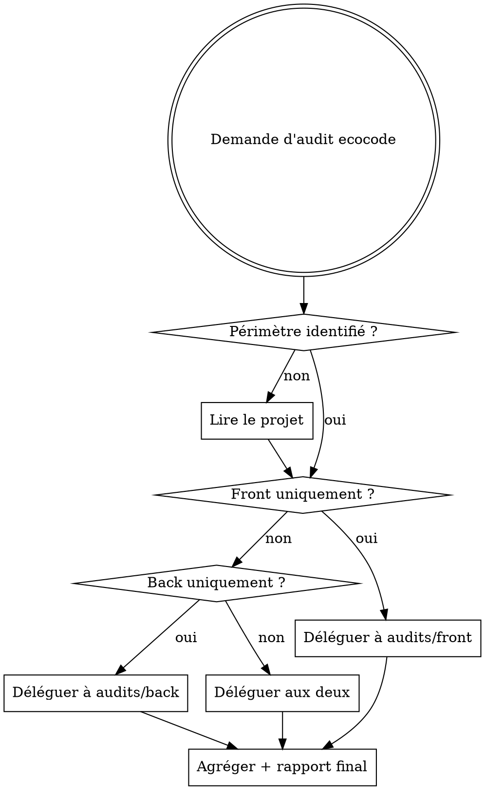

# EcoCode — Skill parent d'orchestration

## Vue d'ensemble

Point d'entrée unique pour tout audit d'éco-conception web. Ce skill identifie le périmètre (front, back, ou les deux), délègue aux sous-skills spécialisés, et produit un rapport synthétique final avec score d'impact et priorités de correction.

L'audit est piloté par `ecocode-orchestrator`. Les six rôles partagent les
mêmes noms dans Claude Code, OpenCode et Codex : `ecocode-orchestrator`,
`ecocode-front-analyzer`, `ecocode-back-analyzer`, `ecocode-report-writer`,
`ecocode-planner` et `ecocode-fix-suggester`.

## Deux modes complémentaires

- **Conception et développement proactifs :** `design` et `development` sont injectés au démarrage de session et leurs règles s'appliquent automatiquement quand une solution est conçue, écrite ou modifiée.
- **Audit explicite :** ce skill parent s'utilise seulement quand l'utilisateur demande un audit (par exemple `/ecocode`). Il orchestre alors l'analyse approfondie, les rapports et le plan d'action.

**Référentiel de base :** Les 115 bonnes pratiques Green IT accessibles via le MCP `mcp-greenit`.

## Quand utiliser ce skill vs les sous-skills



## Étape −1 — Détecter le mode d'entrée

**Si l'argument est `plan`, `fix`, ou `fix RWEB_XXX` :**

1. Trouver le dernier fichier d'audit :
   ```bash
   ls docs/ecocode/audits/*.md 2>/dev/null | sort -r | head -1
   ```
2. Si aucun fichier trouvé : signaler qu'aucun audit n'existe et continuer vers l'Étape 0 pour un nouvel audit.
3. Si un fichier trouvé : extraire le timestamp du nom de fichier (format `YYYY-MM-DDTHH-MM`), trouver tous les fichiers correspondant à ce timestamp, et déléguer à `audits/resume` avec :
   - `auditPaths` : tous les fichiers de ce timestamp
   - `action` : l'argument reçu
   - `timestamp` : le timestamp extrait

   Terminer. Ne pas continuer vers l'Étape 0.

**Si l'argument est vide (appel standard `/ecocode`) :**

1. Vérifier si `docs/ecocode/audits/` contient des fichiers :
   ```bash
   ls docs/ecocode/audits/*.md 2>/dev/null | wc -l
   ```
2. Si des fichiers existent : trouver le plus récent, extraire et formater lisiblement sa date (ex : `2026-05-19T14-32` → '19 mai 2026 à 14:32'), et demander :
   > "Audit existant trouvé (du {date formatée lisiblement}). Reprendre depuis cet audit ou lancer un nouvel audit ?
   >
   > - **reprendre** — plan d'action, correction ou résumé sans re-analyser
   > - **nouvel** — relancer l'analyse complète
   >
   > (reprendre/nouvel)"
   - Si **reprendre** : déléguer à `audits/resume` avec `action: summary`. Terminer.
   - Si **nouvel** : continuer vers l'Étape 0.
3. Si aucun fichier : continuer vers l'Étape 0.

## Étape 0 — Choisir le mode d'exécution

Avant toute analyse, poser cette question :

> "Mode d'exécution pour cet audit :
>
> - **auto** — l'audit s'enchaîne sans interruption : analyse → fichiers d'audit → plan d'action. Tu reçois un résumé des fichiers créés à la fin.
> - **interactif** — tu confirmes avant l'écriture des fichiers et avant la génération du plan.
>
> (auto/interactif)"

Garder le mode choisi en contexte pour les Étapes 4 et 5.

## Étape 1 — Identifier le périmètre

Indices pour détecter le front :

- Présence de fichiers `.html`, `.jsx`, `.tsx`, `.vue`, `.svelte`
- Dossiers `src/`, `public/`, `assets/`, `components/`
- `package.json` avec dépendances front (React, Vue, Angular, etc.)
- URL fournie par l'utilisateur

Indices pour détecter le back :

- Présence de fichiers `.py`, `.java`, `.go`, `.rb`, `.php`, `.ts` (Node)
- Dossiers `api/`, `server/`, `controllers/`, `models/`, `routes/`
- Fichiers de config BDD (`schema.prisma`, `models.py`, `migration/`)
- `Dockerfile`, `docker-compose.yml`

## Étape 2 — Charger les bonnes pratiques Green IT

Avant toute analyse, consulter le MCP `mcp-greenit` pour obtenir le référentiel complet :

```
mcp-greenit : greenit_lister_fiches          → liste des 115 pratiques
mcp-greenit : greenit_fiches_prioritaires    → pratiques à fort impact
mcp-greenit : greenit_obtenir_fiche_complete → détail d'une pratique spécifique
```

Utiliser `greenit_fiches_prioritaires` pour identifier les pratiques les plus critiques à vérifier en priorité.

## Étape 3 — Déléguer aux sous-skills

| Périmètre  | Sous-skill            | Agent dédié              |
| ---------- | --------------------- | ------------------------ |
| Front-end  | `audits/front`        | `ecocode-front-analyzer` |
| Back-end   | `audits/back`         | `ecocode-back-analyzer`  |
| Full-stack | les deux en parallèle | les deux agents          |

Pour un audit complet, lancer `ecocode-front-analyzer` et
`ecocode-back-analyzer` en parallèle, puis attendre leurs résultats avant de
déléguer au rédacteur et au planificateur.

Pour le front accessible via URL, passer l'URL au sous-skill front.

## Étape 4 — Écrire les fichiers d'audit

**Si mode `auto` :** déléguer immédiatement à `ecocode-report-writer` sans confirmation. Conserver les chemins retournés pour le résumé final de l'Étape 5.

**Si mode `interactif` :** poser d'abord la question :

> "L'analyse est terminée. Veux-tu que j'écrive les fichiers d'audit dans `docs/ecocode/audits/` ? (o/n)"

- Si **oui** : déléguer à `ecocode-report-writer` et afficher les chemins créés.
- Si **non** : terminer. Ne pas passer à l'Étape 5.

Dans les deux cas, transmettre à `ecocode-report-writer` :

- Les résultats complets de l'agent front (tableau de problèmes + bonnes pratiques respectées + métriques EcoIndex)
- Les résultats complets de l'agent back (tableau de problèmes + bonnes pratiques respectées)
- Le nom du projet (déduit du dossier courant ou demandé à l'utilisateur)
- Les scores calculés (EcoIndex officiel + score d'impact interne)

L'agent écrit les fichiers horodatés dans `docs/ecocode/audits/` et retourne leurs chemins.

## Étape 5 — Plan d'action

**Si mode `auto` :** déléguer immédiatement à `ecocode-planner` en lui transmettant :

- L'ensemble des problèmes détectés (couche, localisation, code exact, sévérité, RWEB_XXXX)
- Les bonnes pratiques déjà respectées
- Le timestamp utilisé pour les fichiers d'audit (pour cohérence du nommage)
- Le framework/ORM détecté (pour adapter le code "Après")

Puis afficher le résumé final :

> "Audit terminé. Fichiers créés :
>
> - `docs/ecocode/audits/{timestamp}-audit-front.md`
> - `docs/ecocode/audits/{timestamp}-audit-back.md`
> - `docs/ecocode/plans/{timestamp}-plan.md`"
>
> _(N'afficher que les fichiers effectivement créés selon le périmètre analysé.)_

**Si mode `interactif` :** poser la question :

> "Veux-tu un plan d'action priorisé ? Il liste les corrections P1→P4 avec le code avant/après et les commandes exactes pour chaque problème. (o/n)"

- Si **oui** : déléguer à `ecocode-planner` avec les mêmes données listées ci-dessus. Afficher le chemin du fichier créé :

  > "Plan d'action écrit dans : `docs/ecocode/plans/{timestamp}-plan.md`"

- Si **non** : terminer. Ne pas générer de contenu supplémentaire.

**Règle token :** L'agent planificateur reçoit les données du contexte de la session. Ne pas relancer d'analyse, ne pas relire de fichiers source.

## Calcul de l'EcoIndex officiel

Appeler `mcp-greenit : greenit_calculer_ecoindex` avec les 3 métriques mesurées pendant l'analyse front :

| Paramètre   | Source                                                    |
| ----------- | --------------------------------------------------------- |
| `dom_nodes` | Nœuds DOM comptés via Playwright ou analyse statique HTML |
| `requests`  | Nombre de requêtes HTTP capturées via Playwright          |
| `size_kb`   | Taille totale transférée en KB capturée via Playwright    |
| `url`       | URL analysée (optionnel, pour contexte)                   |

Le MCP retourne :

- Un **score EcoIndex de 0 à 100** (100 = excellent, 0 = très mauvais)
- Un **grade A à G** (A = excellent, G = très mauvais)
- Une estimation des **émissions CO2** et de la **consommation d'eau** par page vue

**Si l'analyse porte uniquement sur du code source (sans URL)**, estimer les métriques à partir de l'analyse statique (compter les éléments HTML, les balises `<script>` et `<link>`, et les tailles de fichiers) puis appeler quand même `calculer_ecoindex` avec ces estimations — en signalant qu'il s'agit d'une estimation.

## Calcul du score d'impact interne

Complémentaire à l'EcoIndex, ce score reflète la gravité qualitative des problèmes détectés sur toutes les couches (front + back) :

- Base : 5/10 (application non analysée)
- Chaque problème **Haute** sévérité : +0,5 point
- Chaque problème **Moyenne** sévérité : +0,2 point
- Chaque bonne pratique déjà respectée : −0,1 point
- Score plafonné entre 1 et 10

Ce score couvre aussi le back-end (où l'EcoIndex ne s'applique pas) et donne une vue holistique de la dette éco-conception.

## Priorisation effort/impact

| Effort \ Impact | Fort                  | Moyen | Faible       |
| --------------- | --------------------- | ----- | ------------ |
| Faible          | P1 — Faire maintenant | P2    | P3           |
| Moyen           | P2                    | P3    | P4           |
| Fort            | P3                    | P4    | Ne pas faire |

## Erreurs fréquentes

- **Ne pas consulter mcp-greenit** : toujours baser l'analyse sur les pratiques officielles, pas sur des suppositions
- **Analyser sans périmètre clair** : demander à l'utilisateur si front/back/les deux ne sont pas évidents
- **Rapport sans plan d'action** : le score seul ne suffit pas, toujours inclure les corrections prioritaires
