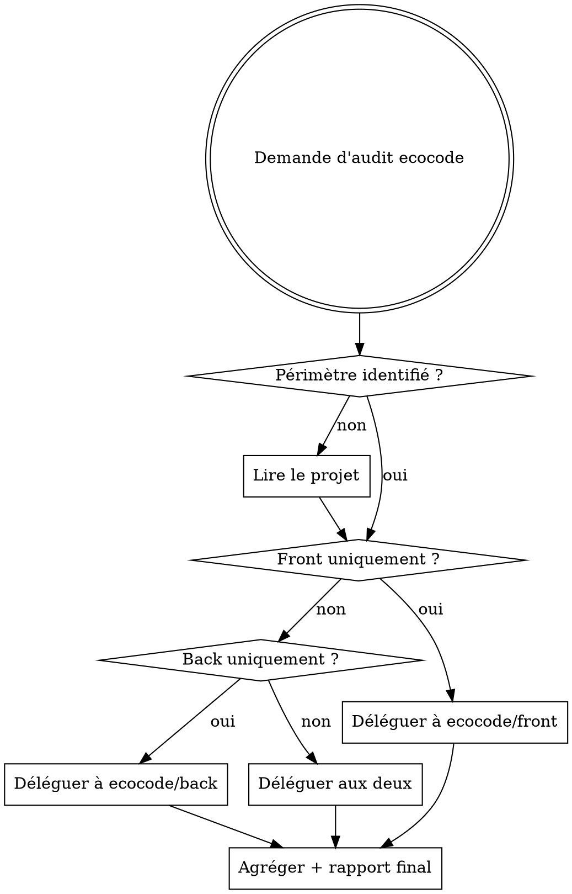

# EcoCode — Skill parent d'orchestration

## Vue d'ensemble

Point d'entrée unique pour tout audit d'éco-conception web. Ce skill identifie le périmètre (front, back, ou les deux), délègue aux sous-skills spécialisés, et produit un rapport synthétique final avec score d'impact et priorités de correction.

**Référentiel de base :** Les 115 bonnes pratiques Green IT accessibles via le MCP `mcp-greenit`.

## Quand utiliser ce skill vs les sous-skills



## Étape 1 — Identifier le périmètre

Indices pour détecter le front :

- Présence de fichiers `.html`, `.jsx`, `.tsx`, `.vue`, `.svelte`
- Dossiers `src/`, `public/`, `assets/`, `components/`
- `package.json` avec dépendances front (React, Vue, Angular, etc.)
- URL fournie par l'utilisateur

Indices pour détecter le back :

- Présence de fichiers `.py`, `.java`, `.go`, `.rb`, `.php`, `.ts` (Node)
- Dossiers `api/`, `server/`, `controllers/`, `models/`, `routes/`
- Fichiers de config BDD (`schema.prisma`, `models.py`, `migration/`)
- `Dockerfile`, `docker-compose.yml`

## Étape 2 — Charger les bonnes pratiques Green IT

Avant toute analyse, consulter le MCP `mcp-greenit` pour obtenir le référentiel complet :

```
mcp-greenit : lister_fiches          → liste des 115 pratiques
mcp-greenit : fiches_prioritaires    → pratiques à fort impact
mcp-greenit : obtenir_fiche_complete → détail d'une pratique spécifique
```

Utiliser `fiches_prioritaires` pour identifier les pratiques les plus critiques à vérifier en priorité.

## Étape 3 — Déléguer aux sous-skills

| Périmètre  | Sous-skill            | Agent dédié              |
| ---------- | --------------------- | ------------------------ |
| Front-end  | `ecocode/front`       | `ecocode-front-analyzer` |
| Back-end   | `ecocode/back`        | `ecocode-back-analyzer`  |
| Full-stack | les deux en parallèle | les deux agents          |

Pour le front accessible via URL, passer l'URL au sous-skill front.

## Étape 4 — Écrire les fichiers d'audit

Déléguer à l'agent `ecocode-report-writer` en lui transmettant :

- Les résultats complets de l'agent front (tableau de problèmes + bonnes pratiques respectées + métriques EcoIndex)
- Les résultats complets de l'agent back (tableau de problèmes + bonnes pratiques respectées)
- Le nom du projet (déduit du dossier courant ou demandé à l'utilisateur)
- Les scores calculés (EcoIndex officiel + score d'impact interne)

L'agent écrit les fichiers horodatés dans `docs/ecocode/audits/` et retourne leurs chemins.

Afficher à l'utilisateur :

> "Audit terminé. Rapports écrits dans :
>
> - `docs/ecocode/audits/{timestamp}-audit-front.md`
> - `docs/ecocode/audits/{timestamp}-audit-back.md`"
>
> _(N'afficher que les fichiers effectivement créés selon le périmètre analysé.)_

## Étape 5 — Plan d'action sur demande

Après avoir affiché les chemins des fichiers d'audit, poser cette question :

> "Veux-tu un plan d'action priorisé ? Il liste les corrections P1→P4 avec le code avant/après et les commandes exactes pour chaque problème. (o/n)"

**Si oui :**
Déléguer à l'agent `ecocode-planner` en lui transmettant :

- L'ensemble des problèmes détectés (couche, localisation, code exact, sévérité, RWEB_XXXX)
- Les bonnes pratiques déjà respectées
- Le timestamp utilisé pour les fichiers d'audit (pour cohérence du nommage)
- Le framework/ORM détecté (pour adapter le code "Après")

L'agent écrit le plan dans `docs/ecocode/plans/{timestamp}-plan.md` et retourne son chemin.

Afficher à l'utilisateur :

> "Plan d'action écrit dans : `docs/ecocode/plans/{timestamp}-plan.md`"

**Si non :**
Terminer. Ne pas générer de contenu supplémentaire.

**Règle token :** L'agent planificateur reçoit les données du contexte de la session. Ne pas relancer d'analyse, ne pas relire de fichiers source.

## Calcul de l'EcoIndex officiel

Appeler `mcp-greenit : calculer_ecoindex` avec les 3 métriques mesurées pendant l'analyse front :

| Paramètre   | Source                                                    |
| ----------- | --------------------------------------------------------- |
| `dom_nodes` | Nœuds DOM comptés via Playwright ou analyse statique HTML |
| `requests`  | Nombre de requêtes HTTP capturées via Playwright          |
| `size_kb`   | Taille totale transférée en KB capturée via Playwright    |
| `url`       | URL analysée (optionnel, pour contexte)                   |

Le MCP retourne :

- Un **score EcoIndex de 0 à 100** (100 = excellent, 0 = très mauvais)
- Un **grade A à G** (A = excellent, G = très mauvais)
- Une estimation des **émissions CO2** et de la **consommation d'eau** par page vue

**Si l'analyse porte uniquement sur du code source (sans URL)**, estimer les métriques à partir de l'analyse statique (compter les éléments HTML, les balises `<script>` et `<link>`, et les tailles de fichiers) puis appeler quand même `calculer_ecoindex` avec ces estimations — en signalant qu'il s'agit d'une estimation.

## Calcul du score d'impact interne

Complémentaire à l'EcoIndex, ce score reflète la gravité qualitative des problèmes détectés sur toutes les couches (front + back) :

- Base : 5/10 (application non analysée)
- Chaque problème **Haute** sévérité : +0,5 point
- Chaque problème **Moyenne** sévérité : +0,2 point
- Chaque bonne pratique déjà respectée : −0,1 point
- Score plafonné entre 1 et 10

Ce score couvre aussi le back-end (où l'EcoIndex ne s'applique pas) et donne une vue holistique de la dette éco-conception.

## Priorisation effort/impact

| Effort \ Impact | Fort                  | Moyen | Faible       |
| --------------- | --------------------- | ----- | ------------ |
| Faible          | P1 — Faire maintenant | P2    | P3           |
| Moyen           | P2                    | P3    | P4           |
| Fort            | P3                    | P4    | Ne pas faire |

## Erreurs fréquentes

- **Ne pas consulter mcp-greenit** : toujours baser l'analyse sur les pratiques officielles, pas sur des suppositions
- **Analyser sans périmètre clair** : demander à l'utilisateur si front/back/les deux ne sont pas évidents
- **Rapport sans plan d'action** : le score seul ne suffit pas, toujours inclure les corrections prioritaires
