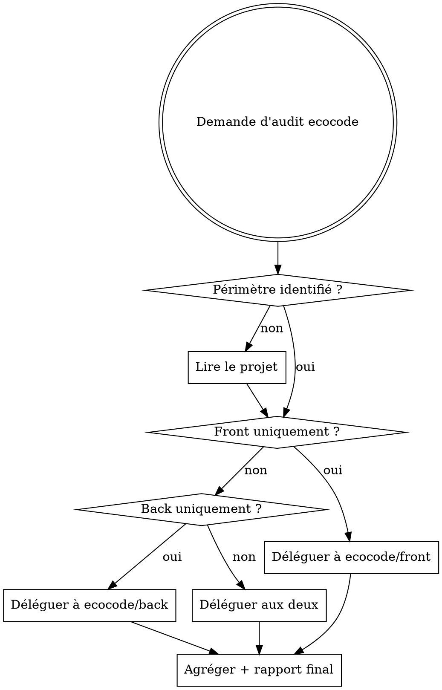

# EcoCode — Skill parent d'orchestration

## Vue d'ensemble

Point d'entrée unique pour tout audit d'éco-conception web. Ce skill identifie le périmètre (front, back, ou les deux), délègue aux sous-skills spécialisés, et produit un rapport synthétique final avec score d'impact et priorités de correction.

**Référentiel de base :** Les 115 bonnes pratiques Green IT accessibles via le MCP `mcp-greenit`.

## Quand utiliser ce skill vs les sous-skills



## Étape 1 — Identifier le périmètre

Indices pour détecter le front :

- Présence de fichiers `.html`, `.jsx`, `.tsx`, `.vue`, `.svelte`
- Dossiers `src/`, `public/`, `assets/`, `components/`
- `package.json` avec dépendances front (React, Vue, Angular, etc.)
- URL fournie par l'utilisateur

Indices pour détecter le back :

- Présence de fichiers `.py`, `.java`, `.go`, `.rb`, `.php`, `.ts` (Node)
- Dossiers `api/`, `server/`, `controllers/`, `models/`, `routes/`
- Fichiers de config BDD (`schema.prisma`, `models.py`, `migration/`)
- `Dockerfile`, `docker-compose.yml`

## Étape 2 — Charger les bonnes pratiques Green IT

Avant toute analyse, consulter le MCP `mcp-greenit` pour obtenir le référentiel complet :

```
mcp-greenit : lister_fiches          → liste des 115 pratiques
mcp-greenit : fiches_prioritaires    → pratiques à fort impact
mcp-greenit : obtenir_fiche_complete → détail d'une pratique spécifique
```

Utiliser `fiches_prioritaires` pour identifier les pratiques les plus critiques à vérifier en priorité.

## Étape 3 — Déléguer aux sous-skills

| Périmètre  | Sous-skill            | Agent dédié              |
| ---------- | --------------------- | ------------------------ |
| Front-end  | `ecocode/front`       | `ecocode-front-analyzer` |
| Back-end   | `ecocode/back`        | `ecocode-back-analyzer`  |
| Full-stack | les deux en parallèle | les deux agents          |

Pour le front accessible via URL, passer l'URL au sous-skill front.

## Étape 4 — Rapport final consolidé

Structure du rapport de synthèse :

```markdown
# Rapport Éco-conception — [Nom du projet]

## Score d'impact global : X/10

_(1 = très éco-responsable, 10 = très énergivore)_

## Top 5 des problèmes critiques

| #   | Problème | Sévérité | Pratique Green IT |
| --- | -------- | -------- | ----------------- |
| 1   | ...      | Haute    | BP-XXX            |

## Résultats Front-end

[Insérer rapport ecocode/front]

## Résultats Back-end

[Insérer rapport ecocode/back]

## Plan d'action priorisé

| Priorité | Action | Effort | Impact | Pratique |
| -------- | ------ | ------ | ------ | -------- |
| 1        | ...    | Faible | Fort   | BP-XXX   |

## Références Green IT mobilisées

[Liste des numéros et intitulés des pratiques citées]
```

## Calcul du score d'impact global

- Base : 5/10 (application non analysée)
- Chaque problème **Haute** sévérité : +0.5 point
- Chaque problème **Moyenne** sévérité : +0.2 point
- Chaque bonne pratique déjà respectée : -0.1 point
- Score plafonné entre 1 et 10

## Priorisation effort/impact

| Effort \ Impact | Fort                  | Moyen | Faible       |
| --------------- | --------------------- | ----- | ------------ |
| Faible          | P1 — Faire maintenant | P2    | P3           |
| Moyen           | P2                    | P3    | P4           |
| Fort            | P3                    | P4    | Ne pas faire |

## Erreurs fréquentes

- **Ne pas consulter mcp-greenit** : toujours baser l'analyse sur les pratiques officielles, pas sur des suppositions
- **Analyser sans périmètre clair** : demander à l'utilisateur si front/back/les deux ne sont pas évidents
- **Rapport sans plan d'action** : le score seul ne suffit pas, toujours inclure les corrections prioritaires
